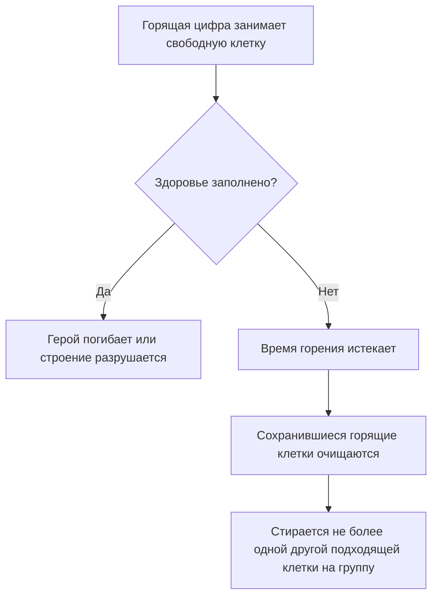

# Огненное торнадо и заряды Судакса - Plan

## Goal Capsule

- **Objective:** Игрок за Судакса может накопить горящие цифры для группового броска или потратить их на точечный удар, а также включить короткий режим временного урона и ускорения.
- **Means:** Добавить «Огненное торнадо» и второй способ применения существующих «Горящих цифр» вне открытого судоку.
- **Product authority:** Подтверждённые в обсуждении правила торнадо, опасного для союзников шара и воздействия на строения; накопление до трёх зарядов пока предложено как стартовая настройка.
- **Open blockers:** Нет.

---

## Product Contract

### Summary

Судакс получает ульту «Огненное торнадо» сверх нынешних «Боевого клича» и «Горящих цифр».
«Горящие цифры» копят заряды: с открытым судоку один заряд действует как сейчас, а без открытого поля весь запас превращается в шар по группе героев.

### Key Decisions

- **Шар как режим «Горящих цифр»:** Вне открытого судоку та же кнопка расходует накопленные заряды на бросок в точку; отдельного дерева шара нет. Governs R1, R2, R8, R15.
- **Опасное лечение союзников:** Шар сначала наносит временный урон союзнику и может убить его до сгорания. (session-settled: user-directed — chosen over safe healing: the user accepted the risk of death before the delayed heal.) Governs R10, R11.
- **Буквально весь исходящий урон:** Торнадо превращает в горящие цифры и урон по строениям. (session-settled: user-directed — chosen over units-only conversion: the user accepted that expiry may erase team progress on structures.) Governs R5.

### Actors

- A1. Игрок за Судакса активирует торнадо, выбирает способ расхода зарядов и повышает ранги торнадо и «Горящих цифр».
- A2. Герои обеих команд в области шара получают временное заполнение здоровья и его последствия.

### Requirements

**Набор и прокачка**

- R1. «Боевой клич» остаётся доступным по нынешним правилам, а «Горящие цифры» сохраняют существующее точечное действие при открытом судоку.
- R2. «Огненное торнадо» имеет три ранга, а «Горящие цифры» сохраняют четыре собственных ранга; отдельного навыка «Куча огненных цифр» нет.
- R3. Улучшения «Горящих цифр» стоят нынешние 3 / 5 / 6 / 7 универсальных цифр по рангам, а улучшения торнадо — 5 / 8 / 11; применение навыков универсальные цифры не тратит.

**Огненное торнадо**

- R4. Торнадо действует только после активации; его длительность, перезарядка, ускорение пера и скорость передвижения масштабируются по таблице ниже.
- R5. Пока действует торнадо, весь входящий урон Судакса и весь наносимый им урон, включая урон по существам и строениям, становится горящими цифрами.
- R6. Горящие цифры входящего урона сгорают через 2 секунды; заполнение здоровья до этого момента может убить Судакса.
- R7. Превращённые исходящие цифры следуют обычному правилу горения и могут привести к гибели цели до сгорания.

| Ранг | Длительность торнадо | Перезарядка | Сокращение перезарядки пера | Ускорение передвижения |
|---|---:|---:|---:|---:|
| 1 | 3 с | 100 с | 10% | 10% |
| 2 | 4,5 с | 85 с | 18% | 15% |
| 3 | 6 с | 70 с | 25% | 20% |

**Заряды «Горящих цифр» и бросок шара**

- R8. Без открытого судоку применение «Горящих цифр» переходит в выбор точки и тратит все накопленные заряды на один шар; при попадании цифры распределяются между живыми героями обеих команд по одной за круг, начиная с ближайшего к центру.
- R9. Навык копит до трёх зарядов, восстанавливая по одному с нынешней перезарядкой ранга; запас шара равен числу потраченных зарядов, умноженному на число цифр одного точечного применения, с пределом на героя из таблицы ниже.
- R10. Союзник получает такое же временное заполнение здоровья, как враг, и может погибнуть до сгорания цифр.
- R11. У выжившего союзника чистое лечение сверх состояния до попадания шара происходит только тогда, когда стирание по R13 убирает другую подходящую заполненную клетку.
- R12. Шар наносит урон только героям; если союзник погиб от шара, Судакс не получает награду за убийство союзника.

| Ранг «Горящих цифр» | Цифр за заряд | Максимум зарядов | Восстановление заряда | Предел шара на героя |
|---|---:|---:|---:|---:|
| 1 | 1 | 3 | 60 с | 2 |
| 2 | 1 | 3 | 45 с | 2 |
| 3 | 2 | 3 | 30 с | 3 |
| 4 | 3 | 3 | 20 с | 3 |

**Общее правило горения**

- R13. Горящие цифры сначала занимают свободные клетки целевого судоку; по истечении времени каждая группа освобождает сохранившиеся горящие клетки и стирает не более одной ближайшей подходящей заполненной клетки на той же странице по нынешнему правилу «Горящих цифр».
- R14. При прицеливании игрок видит накопленные заряды, область шара и предполагаемое число цифр для каждого героя по его текущему положению, включая союзников.
- R15. При открытом судоку применение «Горящих цифр» тратит один заряд и в остальном работает как нынешний точечный навык.

### Key Flows

- F1. **Trigger:** Судакс активирует торнадо доступного ранга. **Actors:** A1, A2. **Steps:** В течение R4 весь урон преобразуется по R5; входящие цифры сгорают по R6, исходящие — по R7 и R13. **Outcome:** По окончании эффекта обычные правила урона, пера и скорости передвижения возвращаются.
- F2. **Trigger:** Судакс применяет «Горящие цифры» без открытого судоку. **Actors:** A1, A2. **Steps:** Игра показывает запас и область по R14; игрок выбирает точку, после чего шар тратит заряды по R8–R9 и применяет горение по R10–R13. **Outcome:** Каждый получатель переживает или не переживает временный урон; у выживших клетки очищаются при сгорании.
- F3. **Trigger:** Судакс применяет «Горящие цифры» при открытом судоку. **Actors:** A1. **Steps:** По R15 расходуется один заряд и выполняется нынешнее точечное действие. **Outcome:** Остальные заряды сохраняются для следующих применений.

### Acceptance Examples

- AE1. **Covers R5, R6, R13.** Если во время торнадо несколько ударов заполнят последние свободные клетки здоровья Судакса до истечения 2 секунд, он погибает; будущее сгорание не отменяет смерть.
- AE2. **Covers R8–R10, R14.** Если Судакс четвёртого ранга накопил три заряда и в области шара находятся два врага и союзник, девять цифр распределяются между ними с пределом три на героя; союзник может погибнуть от временного заполнения.
- AE3. **Covers R5, R7, R13.** Если во время торнадо Судакс наносит урон башне, нанесённые им цифры горят и при сгорании могут стереть ранее заполненную командой клетку.
- AE4. **Covers R10, R11, R13.** Если союзник пережил шар и на его странице есть другая подходящая заполненная клетка, после сгорания группа горящих цифр освобождается и стирает не более одной такой клетки.
- AE5. **Covers R3.** Повышение торнадо до каждого следующего ранга требует указанную в R3 стоимость, тогда как его активация универсальных цифр не тратит.
- AE6. **Covers R10, R11, R13.** Если полностью здоровый союзник пережил шар, а других заполненных клеток на его странице нет, после сгорания он возвращается к исходному здоровью и не получает дополнительного лечения.
- AE7. **Covers R4.** На третьем ранге во время торнадо Судакс движется на 20% быстрее и ждёт перо на 25% меньше; после окончания эффекта обе прибавки исчезают.
- AE8. **Covers R1, R9, R15.** Если при открытом судоку у Судакса накоплены три заряда, одно применение выполняет нынешний точечный навык и оставляет два заряда.
- AE9. **Covers R8, R9.** Если судоку закрыто, применение с тремя зарядами бросает один шар и обнуляет запас; затем заряды восстанавливаются по одному до максимума три.

### Scope Boundaries

- «Боевой клич» сохраняет свой эффект и перезарядку; точечный эффект «Горящих цифр» сохраняется, а его перезарядка становится восстановлением одного заряда.
- Шар не действует на крипов, башни или базу; торнадо действует на любой наносимый Судаксом урон.
- У шара нет отдельного ранга, перезарядки или кнопки; точное управление торнадо и размеры области шара определяются при планировании.

### Dependencies / Assumptions

- Стартовые числа в таблицах служат первой настройкой баланса; дальнейшая корректировка требует игровых проверок.
- Для исходящих цифр торнадо исходная длительность горения — 4 секунды; оба режима «Горящих цифр» используют нынешнюю длительность ранга 4 / 5 / 6 / 7 секунд, а входящие цифры торнадо сгорают за 2 секунды.
- Каждое попадание торнадо образует отдельную группу горящих цифр на получателе; один шар образует одну группу на каждого затронутого героя.
- Герой без свободной клетки пропускается при распределении по R8; предварительный показ по R14 учитывает предел из R9.
- Три заряда — стартовое ограничение для балансировки; при открытии навыка доступен один заряд, затем запас накапливается до максимума.

### Outstanding Questions

- **Deferred to Planning:** Определить дальность броска и радиус попадания шара по масштабу существующих областных навыков.
- **Deferred to Planning:** Выбрать управление торнадо и отображение накопленных зарядов на существующей кнопке «Горящих цифр».

### Sources / Research

- `src/config.js` — нынешние ранги, стоимость обычных улучшений и состав навыков Судакса.
- `src/hero-effects.js` — существующее сгорание группы цифр и стирание дополнительной клетки.
- `src/combat.js` — здоровье как незаполненные клетки и восстановление через стирание заполненных клеток.
- `src/progression.js` — независимые ранги и покупка улучшений универсальными цифрами.
